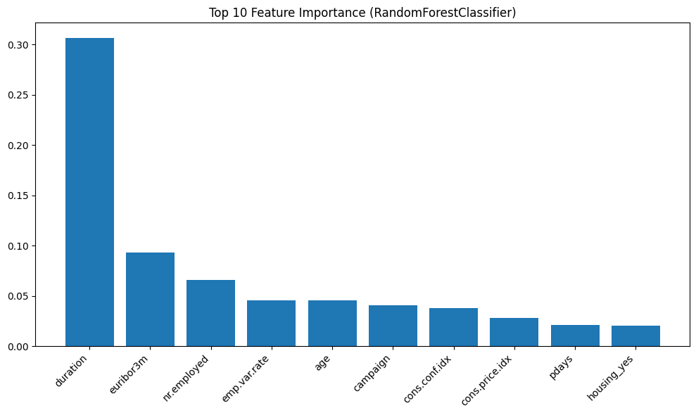

```python
import pandas as pd
import numpy as np
import matplotlib.pyplot as plt
from sklearn.model_selection import train_test_split, GridSearchCV, StratifiedKFold
from sklearn.preprocessing import StandardScaler, OneHotEncoder
from sklearn.compose import ColumnTransformer
from sklearn.linear_model import LogisticRegression
from sklearn.ensemble import RandomForestClassifier, VotingClassifier
from xgboost import XGBClassifier
from sklearn.metrics import classification_report, accuracy_score
from imblearn.over_sampling import SMOTE
from imblearn.pipeline import Pipeline as ImbPipeline
```


```python
def INFO(what):
    print(f">>>>>>> {what} >>>>>>>")
```


```python
INFO("Đặt đường dẫn dataset")
data_path = r"./bank+marketing/bank-additional/bank-additional/bank-additional-full.csv"

INFO("Phân tách csv, ký tự phân tách là `;`")
df = pd.read_csv(data_path, sep=';')

INFO("Kiểm tra kiểu dữ liệu của mỗi cột")
print(df.dtypes)

INFO("Thống kê số lượng thuộc tính theo kiểu dữ liệu")
print("\nSố lượng đặc trưng theo kiểu dữ liệu:")
print(df.dtypes.value_counts())

INFO("Kiểm tra một số dòng đầu tiên để xem dữ liệu thực tế")
INFO("Mẫu dữ liệu:")
print(df.describe())
```

    >>>>>>> Đặt đường dẫn dataset >>>>>>>
    >>>>>>> Phân tách csv, ký tự phân tách là `;` >>>>>>>
    >>>>>>> Kiểm tra kiểu dữ liệu của mỗi cột >>>>>>>
    age                 int64
    job                object
    marital            object
    education          object
    default            object
    housing            object
    loan               object
    contact            object
    month              object
    day_of_week        object
    duration            int64
    campaign            int64
    pdays               int64
    previous            int64
    poutcome           object
    emp.var.rate      float64
    cons.price.idx    float64
    cons.conf.idx     float64
    euribor3m         float64
    nr.employed       float64
    y                  object
    dtype: object
    >>>>>>> Thống kê số lượng thuộc tính theo kiểu dữ liệu >>>>>>>
    
    Số lượng đặc trưng theo kiểu dữ liệu:
    object     11
    int64       5
    float64     5
    Name: count, dtype: int64
    >>>>>>> Kiểm tra một số dòng đầu tiên để xem dữ liệu thực tế >>>>>>>
    >>>>>>> Mẫu dữ liệu: >>>>>>>
                   age      duration      campaign         pdays      previous  \
    count  41188.00000  41188.000000  41188.000000  41188.000000  41188.000000   
    mean      40.02406    258.285010      2.567593    962.475454      0.172963   
    std       10.42125    259.279249      2.770014    186.910907      0.494901   
    min       17.00000      0.000000      1.000000      0.000000      0.000000   
    25%       32.00000    102.000000      1.000000    999.000000      0.000000   
    50%       38.00000    180.000000      2.000000    999.000000      0.000000   
    75%       47.00000    319.000000      3.000000    999.000000      0.000000   
    max       98.00000   4918.000000     56.000000    999.000000      7.000000   
    
           emp.var.rate  cons.price.idx  cons.conf.idx     euribor3m   nr.employed  
    count  41188.000000    41188.000000   41188.000000  41188.000000  41188.000000  
    mean       0.081886       93.575664     -40.502600      3.621291   5167.035911  
    std        1.570960        0.578840       4.628198      1.734447     72.251528  
    min       -3.400000       92.201000     -50.800000      0.634000   4963.600000  
    25%       -1.800000       93.075000     -42.700000      1.344000   5099.100000  
    50%        1.100000       93.749000     -41.800000      4.857000   5191.000000  
    75%        1.400000       93.994000     -36.400000      4.961000   5228.100000  
    max        1.400000       94.767000     -26.900000      5.045000   5228.100000  


```python
INFO("Thống kê các cột categorical")
categorical_cols = df.select_dtypes(include='object').columns
for col in categorical_cols:
    print(f"\n#### {col} ####:")
    print(df[col].value_counts())
```

    >>>>>>> Thống kê các cột categorical >>>>>>>
    
    #### job ####:
    job
    admin.           10422
    blue-collar       9254
    technician        6743
    services          3969
    management        2924
    retired           1720
    entrepreneur      1456
    self-employed     1421
    housemaid         1060
    unemployed        1014
    student            875
    unknown            330
    Name: count, dtype: int64
    
    #### marital ####:
    marital
    married     24928
    single      11568
    divorced     4612
    unknown        80
    Name: count, dtype: int64
    
    #### education ####:
    education
    university.degree      12168
    high.school             9515
    basic.9y                6045
    professional.course     5243
    basic.4y                4176
    basic.6y                2292
    unknown                 1731
    illiterate                18
    Name: count, dtype: int64
    
    #### default ####:
    default
    no         32588
    unknown     8597
    yes            3
    Name: count, dtype: int64
    
    #### housing ####:
    housing
    yes        21576
    no         18622
    unknown      990
    Name: count, dtype: int64
    
    #### loan ####:
    loan
    no         33950
    yes         6248
    unknown      990
    Name: count, dtype: int64
    
    #### contact ####:
    contact
    cellular     26144
    telephone    15044
    Name: count, dtype: int64
    
    #### month ####:
    month
    may    13769
    jul     7174
    aug     6178
    jun     5318
    nov     4101
    apr     2632
    oct      718
    sep      570
    mar      546
    dec      182
    Name: count, dtype: int64
    
    #### day_of_week ####:
    day_of_week
    thu    8623
    mon    8514
    wed    8134
    tue    8090
    fri    7827
    Name: count, dtype: int64
    
    #### poutcome ####:
    poutcome
    nonexistent    35563
    failure         4252
    success         1373
    Name: count, dtype: int64
    
    #### y ####:
    y
    no     36548
    yes     4640
    Name: count, dtype: int64


```python
INFO("Kiểm tra biến Y xem có cân bằng không")
yes_count = (df['y'] == "yes").sum()
no_count = (df['y'] == "no").sum()
print(f'#yes = {yes_count}; %ratio = {100*(yes_count/(no_count+yes_count))}%')
print(f'#no = {no_count}; %ratio = {100*(no_count/(no_count+yes_count))}%')
INFO("Từ kết quả, cho thấy dữ liệu không cân bằng!")
```

    >>>>>>> Kiểm tra biến Y xem có cân bằng không >>>>>>>
    #yes = 4640; %ratio = 11.265417111780131%
    #no = 36548; %ratio = 88.73458288821988%
    >>>>>>> Từ kết quả, cho thấy dữ liệu không cân bằng! >>>>>>>


```python
# INFO("Mã hóa dữ liệu ")
# label_encoders = {}
# categorical_cols = [col for col in df.columns if df[col].dtype == 'object' and col != 'y']
# for col in categorical_cols:
#     print(f"Processing `{col}` \t\tcolumn \t\t/ `{df[col].dtype}`...")
#     le = LabelEncoder()
#     df[col] = le.fit_transform(df[col])
#     label_encoders[col] = le
# # Encode y separately
# df['y'] = df['y'].map({'yes': 1, 'no': 0})  # Or use LabelEncoder if preferred
# df.describe()
```


```python
INFO("Chia IN/OUT")
X, Y = df.drop(columns=['y']), df['y'].map({'yes': 1, 'no': 0})
INFO("X:")
print(X.describe())
INFO("Y:")
print(Y.describe())
```

    >>>>>>> Chia IN/OUT >>>>>>>
    >>>>>>> X: >>>>>>>
                   age      duration      campaign         pdays      previous  \
    count  41188.00000  41188.000000  41188.000000  41188.000000  41188.000000   
    mean      40.02406    258.285010      2.567593    962.475454      0.172963   
    std       10.42125    259.279249      2.770014    186.910907      0.494901   
    min       17.00000      0.000000      1.000000      0.000000      0.000000   
    25%       32.00000    102.000000      1.000000    999.000000      0.000000   
    50%       38.00000    180.000000      2.000000    999.000000      0.000000   
    75%       47.00000    319.000000      3.000000    999.000000      0.000000   
    max       98.00000   4918.000000     56.000000    999.000000      7.000000   
    
           emp.var.rate  cons.price.idx  cons.conf.idx     euribor3m   nr.employed  
    count  41188.000000    41188.000000   41188.000000  41188.000000  41188.000000  
    mean       0.081886       93.575664     -40.502600      3.621291   5167.035911  
    std        1.570960        0.578840       4.628198      1.734447     72.251528  
    min       -3.400000       92.201000     -50.800000      0.634000   4963.600000  
    25%       -1.800000       93.075000     -42.700000      1.344000   5099.100000  
    50%        1.100000       93.749000     -41.800000      4.857000   5191.000000  
    75%        1.400000       93.994000     -36.400000      4.961000   5228.100000  
    max        1.400000       94.767000     -26.900000      5.045000   5228.100000  
    >>>>>>> Y: >>>>>>>
    count    41188.000000
    mean         0.112654
    std          0.316173
    min          0.000000
    25%          0.000000
    50%          0.000000
    75%          0.000000
    max          1.000000
    Name: y, dtype: float64


```python
INFO("Chia tập dữ liệu với stratify để đảm bảo tỷ lệ lớp ")
test_size=0.1 
X_train, X_test, Y_train, Y_test = train_test_split(
    X, 
    Y, 
    test_size=test_size, 
    random_state=42, 
    stratify=Y
)
INFO("X_train:")
print(X_train.head())
INFO("Y_train:")
print(Y_train.head())
```

    >>>>>>> Chia tập dữ liệu với stratify để đảm bảo tỷ lệ lớp  >>>>>>>
    >>>>>>> X_train: >>>>>>>
           age          job   marital            education  default housing loan  \
    8061    52   technician  divorced  professional.course  unknown     yes   no   
    25300   36   management   married    university.degree       no     yes   no   
    17667   53  blue-collar   married          high.school       no     yes  yes   
    37400   45  blue-collar    single             basic.9y       no     yes   no   
    4629    60    housemaid   married          high.school  unknown     yes   no   
    
             contact month day_of_week  duration  campaign  pdays  previous  \
    8061   telephone   jun         mon        56         8    999         0   
    25300   cellular   nov         tue       267         2    999         0   
    17667   cellular   jul         mon       243         2    999         0   
    37400   cellular   aug         wed       249         1      4         1   
    4629   telephone   may         wed        74         1    999         0   
    
              poutcome  emp.var.rate  cons.price.idx  cons.conf.idx  euribor3m  \
    8061   nonexistent           1.4          94.465          -41.8      4.865   
    25300  nonexistent          -0.1          93.200          -42.0      4.153   
    17667  nonexistent           1.4          93.918          -42.7      4.962   
    37400      success          -2.9          92.201          -31.4      0.879   
    4629   nonexistent           1.1          93.994          -36.4      4.858   
    
           nr.employed  
    8061        5228.1  
    25300       5195.8  
    17667       5228.1  
    37400       5076.2  
    4629        5191.0  
    >>>>>>> Y_train: >>>>>>>
    8061     0
    25300    0
    17667    0
    37400    0
    4629     0
    Name: y, dtype: int64


```python
INFO("Training class distribution:")
print(Y_train.value_counts(normalize=True) * 100)
INFO("Test class distribution:")
print(Y_test.value_counts(normalize=True) * 100)
```

    >>>>>>> Training class distribution: >>>>>>>
    y
    0    88.734522
    1    11.265478
    Name: proportion, dtype: float64
    >>>>>>> Test class distribution: >>>>>>>
    y
    0    88.73513
    1    11.26487
    Name: proportion, dtype: float64


```python
INFO("Tách dữ liệu số (numberical) và dữ liệu dạng phân loại (categorical)")
categorical_features = df.select_dtypes(include=['object']).columns.tolist()
numerical_features = df.select_dtypes(include=['int64', 'float64']).columns.tolist()
INFO("Tách target và features của lớp dữ liệu categorical")
categorical_features.remove('y')  
```

    >>>>>>> Tách dữ liệu số (numberical) và dữ liệu dạng phân loại (categorical) >>>>>>>
    >>>>>>> Tách target và features của lớp dữ liệu categorical >>>>>>>


```python
INFO("Xây dựng pipeline với OneHotEncoder và SMOTE")
INFO("Xác định bộ tiền xử lý với OneHotenCoder cho các tính năng phân loại")
scaler = StandardScaler()
ohe = OneHotEncoder(drop='first', sparse_output=False, handle_unknown='ignore')
preprocessor = ColumnTransformer([
    ('num', scaler, numerical_features),
    ('cat', ohe, categorical_features)
])
```

    >>>>>>> Xây dựng pipeline với OneHotEncoder và SMOTE >>>>>>>
    >>>>>>> Xác định bộ tiền xử lý với OneHotenCoder cho các tính năng phân loại >>>>>>>


```python
voting_clf = VotingClassifier(
    estimators=[
        ('lr', ImbPipeline([
            ('preprocessor', preprocessor),
            ('smote', SMOTE(random_state=42)),
            ('classifier', LogisticRegression(solver='liblinear', random_state=42))
        ])),
        ('rf', ImbPipeline([
            ('preprocessor', preprocessor),
            ('smote', SMOTE(random_state=42)),
            ('classifier', RandomForestClassifier(random_state=42))
        ])),
        ('xgb', ImbPipeline([
            ('preprocessor', preprocessor),
            ('smote', SMOTE(random_state=42)),
            ('classifier', XGBClassifier(eval_metric='logloss', random_state=42))
        ]))
    ],
    voting='soft'
)
param_grid = {
    'lr__smote__sampling_strategy': [0.3, 0.5, 0.7],
    'rf__smote__sampling_strategy': [0.3, 0.5, 0.7],
    'xgb__smote__sampling_strategy': [0.3, 0.5, 0.7],
    'lr__classifier__C': [0.1, 1.0, 10.0],
    'rf__classifier__max_depth': [10, 20, None],
    'xgb__classifier__learning_rate': [0.01, 0.1]
}
```


```python
cv = StratifiedKFold(n_splits=5, shuffle=True, random_state=42)
grid_search = GridSearchCV(
    voting_clf,
    param_grid=param_grid,
    cv=cv,
    scoring='f1_macro',
    n_jobs=-1,
    verbose=1
)
```


```python
import os
import joblib

best_threshold=0.7

model_file = "best_model.pkl"
if os.path.exists(model_file):
    INFO("Tệp best_model.pkl tồn tại, đang tải mô hình...")
    loaded_model = joblib.load(model_file)
    
    INFO("Đánh giá mô hình đã tải trên tập test")
    Y_prob_loaded = loaded_model.predict_proba(X_test)[:, 1]
    Y_pred_loaded = (Y_prob_loaded >= best_threshold).astype(int)  # Use the best threshold
    print(classification_report(Y_test, Y_pred_loaded, target_names=['no', 'yes']))
    print(f"Accuracy: {accuracy_score(Y_test, Y_pred_loaded)}")
else:
    INFO("Tệp best_model.pkl không tồn tại, lưu mô hình hiện tại...")
```

    >>>>>>> Tệp best_model.pkl tồn tại, đang tải mô hình... >>>>>>>


    >>>>>>> Đánh giá mô hình đã tải trên tập test >>>>>>>
                  precision    recall  f1-score   support
    
              no       0.93      0.98      0.95      3655
             yes       0.74      0.41      0.53       464
    
        accuracy                           0.92      4119
       macro avg       0.83      0.70      0.74      4119
    weighted avg       0.91      0.92      0.91      4119
    
    Accuracy: 0.9174556931294003


```python
INFO("Đánh giá VotingClassifier với GridSearchCV")
grid_search.fit(X_train, Y_train)

import joblib
joblib.dump(grid_search.best_estimator_, 'best_model.pkl')
```

    >>>>>>> Đánh giá VotingClassifier với GridSearchCV >>>>>>>
    Fitting 5 folds for each of 486 candidates, totalling 2430 fits


    ['best_model.pkl']


```python
INFO("Các tham số được chọn (best parameters):")
for param, value in grid_search.best_params_.items():
    print(f"{param}: {value}")
INFO("Điểm số F1-macro tốt nhất (cross-validation):")
print(f"{grid_search.best_score_:.3f}")
```

    >>>>>>> Các tham số được chọn (best parameters): >>>>>>>
    lr__classifier__C: 1.0
    lr__smote__sampling_strategy: 0.7
    rf__classifier__max_depth: None
    rf__smote__sampling_strategy: 0.5
    xgb__classifier__learning_rate: 0.1
    xgb__smote__sampling_strategy: 0.3
    >>>>>>> Điểm số F1-macro tốt nhất (cross-validation): >>>>>>>
    0.801


```python
Y_prob = grid_search.predict_proba(X_test)[:, 1]
Y_pred = (Y_prob >= 0.7).astype(int) 
print(classification_report(Y_test, Y_pred, target_names=['no', 'yes']))
print(f"Accuracy: {accuracy_score(Y_test, Y_pred)}")
```

                  precision    recall  f1-score   support
    
              no       0.93      0.98      0.95      3655
             yes       0.74      0.41      0.53       464
    
        accuracy                           0.92      4119
       macro avg       0.83      0.70      0.74      4119
    weighted avg       0.91      0.92      0.91      4119
    
    Accuracy: 0.9174556931294003


```python
INFO("Hiển thị tầm quan trọng của đặc trưng")
# Access the RandomForestClassifier pipeline from the VotingClassifier
rf_pipeline = grid_search.best_estimator_.named_estimators_['rf']
# Now access the steps within the RandomForestClassifier pipeline
ohe_features = rf_pipeline.named_steps['preprocessor'].named_transformers_['cat'].get_feature_names_out(categorical_features)
feature_names = np.concatenate([numerical_features, ohe_features])
importances = rf_pipeline.named_steps['classifier'].feature_importances_
indices = np.argsort(importances)[::-1][:10]  # Top 10 features
plt.figure(figsize=(10, 6))
plt.bar(range(10), importances[indices], align='center')
plt.xticks(range(10), [feature_names[i] for i in indices], rotation=45, ha='right')
plt.title("Top 10 Feature Importance (RandomForestClassifier)")
plt.tight_layout()
plt.show()

INFO("Top 10 đặc trưng quan trọng:")
for i in indices[:10]:
    print(f"{feature_names[i]}: {importances[i]:.4f}")
```

    >>>>>>> Hiển thị tầm quan trọng của đặc trưng >>>>>>>


    

    


    >>>>>>> Top 10 đặc trưng quan trọng: >>>>>>>
    duration: 0.3062
    euribor3m: 0.0932
    nr.employed: 0.0657
    emp.var.rate: 0.0455
    age: 0.0454
    campaign: 0.0407
    cons.conf.idx: 0.0378
    cons.price.idx: 0.0280
    pdays: 0.0210
    housing_yes: 0.0207

